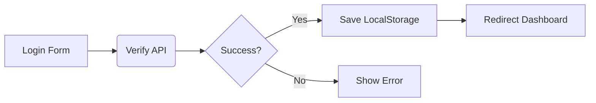

# 🛠️ SPA SURVIVAL GUIDE: JavaScript Vanilla + json-server

Guía técnica de consulta rápida para desarrollo de SPAs sin frameworks.

---

## 📑 TABLA DE CONTENIDO

1.  [EXAM WORKFLOW](#1-exam-workflow)
2.  [PROJECT STRUCTURE](#2-project-structure)
3.  [JAVASCRIPT ESSENTIALS](#3-javascript-essentials)
4.  [ARRAY METHODS CHEATSHEET](#4-array-methods-cheatsheet)
5.  [DOM CHEATSHEET](#5-dom-cheatsheet)
6.  [EVENTS CHEATSHEET](#6-events-cheatsheet)
7.  [EVENT DELEGATION](#7-event-delegation)
8.  [FETCH RECIPES](#8-fetch-recipes)
9.  [JSON SERVER](#9-json-server)
10. [AUTHENTICATION](#10-authentication)
11. [LOCALSTORAGE CHEATSHEET](#11-localstorage-cheatsheet)
12. [ROLE MANAGEMENT](#12-role-management)
13. [SPA ROUTING](#13-spa-routing)
14. [ROUTE GUARDS](#14-route-guards)
15. [CRUD ARCHITECTURE](#15-crud-architecture)
16. [DASHBOARD PATTERNS](#16-dashboard-patterns)
17. [SEARCH AND FILTERS](#17-search-and-filters)
18. [FORM VALIDATION](#18-form-validation)
19. [ERROR HANDLING](#19-error-handling)
20. [DEBUGGING GUIDE](#20-debugging-guide)
21. [COMMON EXAM TASKS](#21-common-exam-tasks)
22. [TAILWIND COMPONENTS](#22-tailwind-components)
23. [COMMON MISTAKES](#23-common-mistakes)
24. [FINAL CHECKLIST](#24-final-checklist)

---

## 1. EXAM WORKFLOW

Orden estratégico para maximizar puntos en tiempo récord.

- [ ] **Estructura:** Crear carpetas y archivos base (10 min).
- [ ] **API:** Configurar `db.json` y arrancar `json-server` (5 min).
- [ ] **Auth:** Login, LocalStorage y Logout (20 min).
- [ ] **Router:** Implementar History API y rutas (15 min).
- [ ] **Guards:** Proteger rutas por sesión y rol (10 min).
- [ ] **CRUD:** Listado, Creación, Edición y Borrado (40 min).
- [ ] **Dashboard:** Lógica de contadores y filtros (20 min).
- [ ] **UI/UX:** Responsive, Toasts y Loaders (20 min).
- [ ] **Final Fixes:** Debugging y limpieza de consola (10 min).

---

## 2. PROJECT STRUCTURE

Organización modular profesional.

```text
src/
├── api/        # Configuración de Fetch/Axios (client.js)
├── auth/       # Lógica de login/logout (authService.js)
├── router/     # Definición de rutas y motor de navegación (router.js)
├── views/      # Funciones que retornan el HTML de cada página
├── components/ # Elementos reutilizables (Navbar, Cards, Modals)
├── services/   # Llamadas específicas a la API (productService.js)
├── guards/     # Middlewares de protección (authGuard.js)
├── utils/      # Helpers (notificaciones, formateadores, loaders)
├── styles/     # CSS Global o Tailwind configs
└── main.js     # Punto de entrada de la aplicación
```

---

## 3. JAVASCRIPT ESSENTIALS

Solo lo que realmente vas a usar.

| Feature | Uso | Ejemplo |
| :--- | :--- | :--- |
| `let/const` | Variables vs Constantes | `const API_URL = '...'; let products = [];` |
| `Destructuring` | Extraer propiedades | `const { name, price } = product;` |
| `Spread` | Clonar/Combinar | `const newProd = { ...prod, stock: 10 };` |
| `Template Lit.` | HTML Dinámico | `` `<h1>${title}</h1>` `` |
| `Import/Export`| Modularización | `export const login = () => ...;` |

---

## 4. ARRAY METHODS CHEATSHEET

Manipulación de datos para Dashboards y CRUDs.

```javascript
// 1. Encontrar un elemento (Login/Detalles)
const user = users.find(u => u.email === email);

// 2. Filtrar elementos (Buscador/Filtros/Roles)
const myProducts = products.filter(p => p.userId === currentUserId);

// 3. Transformar datos (Renderizado de listas)
const listItems = products.map(p => `<li>${p.name}</li>`).join("");

// 4. Calcular totales (Dashboard)
const totalStock = products.reduce((acc, p) => acc + p.stock, 0);

// 5. Verificar condiciones (Validaciones)
const hasOutStock = products.some(p => p.stock === 0);
```

---

## 5. DOM CHEATSHEET

Manipulación directa de la interfaz.

```javascript
const app = document.querySelector("#app"); // Selección
const btn = document.createElement("button"); // Creación
btn.textContent = "Eliminar"; // Texto
btn.classList.add("btn-red"); // Clases
app.appendChild(btn); // Inserción
app.innerHTML = "<div>...</div>"; // Inyección masiva
const id = target.dataset.id; // Leer data-id="123"
```

---

## 6. EVENTS CHEATSHEET

Interacción con el usuario.

```javascript
// Formulario
form.addEventListener("submit", (e) => {
  e.preventDefault(); // OBLIGATORIO
  const formData = new FormData(e.target);
  const data = Object.fromEntries(formData);
});

// Input (Buscador en tiempo real)
search.addEventListener("input", (e) => console.log(e.target.value));
```

---

## 7. EVENT DELEGATION

Patrón óptimo para listas dinámicas (Edit/Delete).

```javascript
document.addEventListener("click", (e) => {
  const target = e.target.closest("[data-action]");
  if (!target) return;

  const id = target.dataset.id;
  const action = target.dataset.action;

  if (action === "delete") deleteProduct(id);
  if (action === "edit") openEditModal(id);
});
```

---

## 8. FETCH RECIPES

Chuleta rápida de peticiones HTTP.

```javascript
const request = async (url, method = "GET", body = null) => {
  const options = {
    method,
    headers: { "Content-Type": "application/json" }
  };
  if (body) options.body = JSON.stringify(body);
  
  const res = await fetch(url, options);
  if (!res.ok) throw new Error("Error en la petición");
  return await res.json();
};

// Uso:
const prods = await request("url/products"); // GET
await request("url/products", "POST", { name: "Nuevo" }); // POST
```

---

## 9. JSON SERVER

Configuración de la API simulada.

**Instalación y Uso:**
```bash
npm install -g json-server
json-server --watch db.json --port 3000
```

**Filtros en URL:**
- `?q=busqueda` (Búsqueda global)
- `?category=ropa&stock_gte=10` (Filtros exactos y >=)
- `?_sort=price&_order=desc` (Ordenación)
- `?_expand=user` (Incluir relación)

---

## 10. AUTHENTICATION

Flujo de sesión completo.



```javascript
// login.js
const handleLogin = async (email, password) => {
  const users = await request(`${API}/users?email=${email}&password=${password}`);
  if (users.length > 0) {
    localStorage.setItem("user", JSON.stringify(users[0]));
    navigate("/dashboard");
  }
};
```

---

## 11. LOCALSTORAGE CHEATSHEET

Persistencia de datos.

```javascript
const save = (key, val) => localStorage.setItem(key, JSON.stringify(val));
const get = (key) => JSON.parse(localStorage.getItem(key));
const remove = (key) => localStorage.removeItem(key);
const clear = () => localStorage.clear();
```

---

## 12. ROLE MANAGEMENT

Restricción de UI por rol.

```javascript
const user = get("user");

// En el renderizado:
const actionButtons = user.role === "admin" 
  ? `<button data-action="delete">Eliminar</button>` 
  : "";

// En las acciones:
if (action === "delete" && user.role !== "admin") return alert("No autorizado");
```

---

## 13. SPA ROUTING

El motor de la aplicación.

```javascript
const routes = {
  "/": LoginView,
  "/dashboard": DashboardView,
  "/products": ProductsView
};

const router = () => {
  const path = window.location.pathname;
  const view = routes[path] || NotFoundView;
  document.querySelector("#app").innerHTML = view();
};

const navigate = (url) => {
  window.history.pushState({}, "", url);
  router();
};

window.addEventListener("popstate", router);
```

---

## 14. ROUTE GUARDS

Seguridad en la navegación.

```javascript
const checkAuth = () => {
  const user = get("user");
  const path = window.location.pathname;

  if (!user && path !== "/") return navigate("/");
  if (user && path === "/") return navigate("/dashboard");
};
```

---

## 15. CRUD ARCHITECTURE

Patrón Service -> View.

1. **Service:** `getProducts()`, `createProduct(data)`, `deleteProduct(id)`.
2. **View:** Llama al service y retorna el HTML.
3. **Controller (main.js):** Escucha eventos y llama a los services.

---

## 16. DASHBOARD PATTERNS

Cálculo de métricas instantáneo.

```javascript
const stats = {
  total: products.length,
  lowStock: products.filter(p => p.stock < 5).length,
  categories: [...new Set(products.map(p => p.category))].length,
  totalValue: products.reduce((acc, p) => acc + (p.price * p.stock), 0)
};
```

---

## 17. SEARCH AND FILTERS

Lógica combinada.

```javascript
const filtered = products.filter(p => {
  const matchName = p.name.toLowerCase().includes(searchTerm.toLowerCase());
  const matchCat = category === "all" || p.category === category;
  return matchName && matchCat;
});
```

---

## 18. FORM VALIDATION

Validación básica pero efectiva.

```javascript
const validate = (data) => {
  const errors = {};
  if (!data.email.includes("@")) errors.email = "Email inválido";
  if (data.password.length < 6) errors.password = "Mínimo 6 caracteres";
  return errors;
};
```

---

## 19. ERROR HANDLING

Captura de fallos centralizada.

```javascript
try {
  await request("/data");
} catch (err) {
  showToast(err.message, "error");
}
```

---

## 20. DEBUGGING GUIDE

1. **¿Página en blanco?** Revisa si el ID `#app` existe en HTML.
2. **¿Rutas no cargan?** Revisa si olvidaste llamar a `router()` al inicio.
3. **¿Fetch falla?** Revisa `json-server` (consola de comandos).
4. **¿Datos indefinidos?** Revisa si falta un `await` o si el objeto tiene la estructura esperada.

---

## 21. COMMON EXAM TASKS

- **Mostrar nombre de usuario:** `` `Hola, ${user.name}` ``
- **Ocultar Sidebar en Login:** `if (path === "/") sidebar.hide()`
- **Contar elementos:** `.length`
- **Formatear moneda:** `price.toLocaleString('es-CO', { style: 'currency', currency: 'COP' })`

---

## 22. TAILWIND COMPONENTS

Snippets rápidos para copiar.

**Navbar:**
```html
<nav class="bg-blue-600 text-white p-4 flex justify-between items-center">
  <h1 class="font-bold">StoreManager</h1>
  <button id="logout" class="bg-red-500 px-3 py-1 rounded">Logout</button>
</nav>
```

**Card:**
```html
<div class="border rounded shadow p-4 hover:shadow-lg transition">
  <h2 class="text-xl font-semibold">${product.name}</h2>
  <p class="text-gray-500">${product.category}</p>
  <div class="mt-4 flex justify-between">
    <span class="font-bold">$${product.price}</span>
    <span class="text-sm">Stock: ${product.stock}</span>
  </div>
</div>
```

---

## 23. COMMON MISTAKES

1. ❌ Olvidar `e.preventDefault()` en formularios.
2. ❌ No usar `await` en llamadas `async`.
3. ❌ Guardar objetos en LocalStorage sin `JSON.stringify()`.
4. ❌ No llamar a `router()` en el `DOMContentLoaded`.
5. ❌ Usar `==` en lugar de `===`.
6. ❌ No manejar el caso de `response.ok` en Fetch.
7. ❌ Olvidar limpiar el `app.innerHTML` antes de un nuevo renderizado (si aplica).
8. ❌ Definir rutas que no empiezan con `/`.

---

## 24. FINAL CHECKLIST

- [ ] Login/Logout 100% funcional.
- [ ] CRUD completo (C-R-U-D).
- [ ] Rutas protegidas (no se puede entrar al dashboard sin login).
- [ ] Dashboards muestran datos reales de la API.
- [ ] Filtros y buscador funcionan coordinados.
- [ ] Responsive (Tailwind `sm:`, `md:`, `lg:`).
- [ ] Mensajes de éxito/error al usuario.
- [ ] Consola limpia de errores rojos.

---
*Fin de la guía. ¡Mucho éxito en el examen!* 🚀
